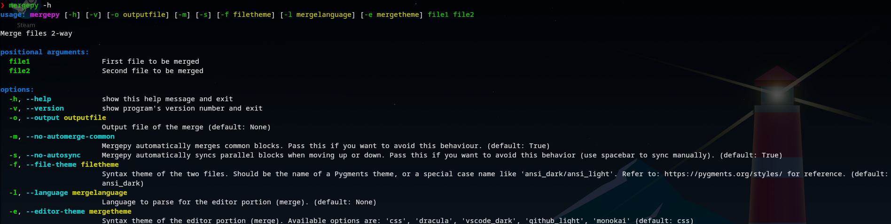

# `mergepy`

>[!important]
> TODO: Implement compatibility with git so it can be used as a mergetool 

## ℹ️ About

Mergepy is a cli-based python tool designed to merge 2 files together interactively by segmenting the 2 files into parts that are different and common. You easily select, then choose to keep or replace the conflicts by jumping between 2 panes and pressing enter (which will always replace a different part of the file and keep a common part) which will insert the selected text into a third pane which can be also used to edit the result. Mergepy uses python's standard 'difflib' to segment the files and uses textual, uses a rich renderable to highlight the syntax for the 2 file panes and uses treesitter to highlight the syntax in the editor pane.

## 🎬 Demo


## 📥 Installing

It's adviced to install this project using something like [pipx](https://github.com/pypa/pipx) to install a project from pip systemwide:

```bash
pipx install mergepy
```

If you're using bash or zsh (linux, macOs), it's advisable to install `argcomplete` from your available packagemanager so you can autocomplete mergepy's flags and options in the terminal.

Debian (Linux):

```bash
sudo apt install python3-argcomplete
```

Arch (Linux):

```bash
sudo pacman -S python-argcomplete
```

macOs:

```bash
brew install argcomplete
```

After installing argcomplete, run `activate-global-python-argcomplete` to activate autocompletions for all installed python packages
If that doesn't work or you don't want to do that, you can also always just add autocompletion for one specific package. For mergepy autocompletion only, put this in you ~/.bashrc or ~/.zshrc:

```bash
eval "$(register-python-argcomplete mergepy)"
```

Once everything is installed, just run:

```bash
mergepy filename1 filename2
```
to pick out your preffered changes between 2 similar files

## ✨ Flags and features



 - Mergepy expects the paths of 2 filenames to start up
 - When supplying mergepy with the `--output, -o 'filename'` flag before starting up, you can preset to what file the output will be written to. If the flag was not supplied, mergepy will attempt to bring up a file-explorer when you want to save. 
 - By default, mergepy will look at the extension of the filename and base the syntax of the file and merge pane on said extension. When `--language, -l 'language'` is given before starting up, mergepy will force said language for the syntaxing (for the editor part - option for the filepanes to come). Available options are 'typescript, javascript, python, swift  bash, zsh, yaml, rust, ruby, html, java, json, php, css, c, cpp and go'
 - By default, mergepy will attempt to automatically merge common blocks. This feature can be turned off using `--no-automerge-common, -m`
 - By default, mergepy will attempt to autoscroll to the associated block in the second filepane when scrolling through one of the filepanes. This behaviour can be turned off with the `--no-autosync, -s` flag, though when given you can still manually sync by pressing space when hovering over a block.
 - To set the syntaxtheme for the filepanes, use `--file-theme, -f 'theme'`. These panes use [Rich renderable from textual](https://textual.textualize.io/guide/widgets/#rich-renderables) for syntaxing, which uses the selection of themes from [pygments](https://pygments.org/styles/) as options.
- To set the syntaxtheme for the mergepane, use `--editor-theme, -e 'theme'`. This pane uses [python's treesitter](https://pypi.org/project/tree-sitter/) for syntaxing. The options for this flag are: 'css(default)', 'dracula', 'vscode_dark', 'github_light', 'monokai'

## ⌨ Actions

Mergepy includes a footer, provided by [Textual](https://textual.textualize.io), that shows the available commands. These are:

- Enter: This will Replace a different textblock and keep a common textblock
- R - Replace: Only available for different textblocks; 
  keeps the highlighted block for one file, removes the associated block for the other file
- K - Keep: Keeps the currently highlighted block without removing the block in the other file
  note: keeping a common blocks will remove the same block in the second file to avoid duplicates
- Up/down inside of filepanes: Select the next block
- Ctrl-up/down/left/right: Move to next pane
- Shift-up/down/left/right inside file panes: Scroll through pane
- Shift-up/down/left/right inside merge pane: Select text
- Alt-up/down inside file panes: Scroll to next conflict
- Alt-up/down/left/right inside merge pane: Scroll through text
- Space: Sync conflicts (only necessary when using the `--no-autosync, -s` flag)
- Ctrl-z: undo
- Ctrl-y: redo
- Ctrl-s: save
- Ctrl-q: quit; will bring up a warning if you have not saved before.


## 🛠️ Technologies

The project is built with:

- [Textual](https://textual.textualize.io)
- [Rich](https://github.com/Textualize/rich)
- [Argcomplete](https://pypi.org/project/argcomplete/)
- [PySide6](https://pypi.org/project/PySide6/)
- [Zenity](https://pypi.org/project/Zenity/)
- [Tree-sitter](https://pypi.org/project/tree-sitter/)
